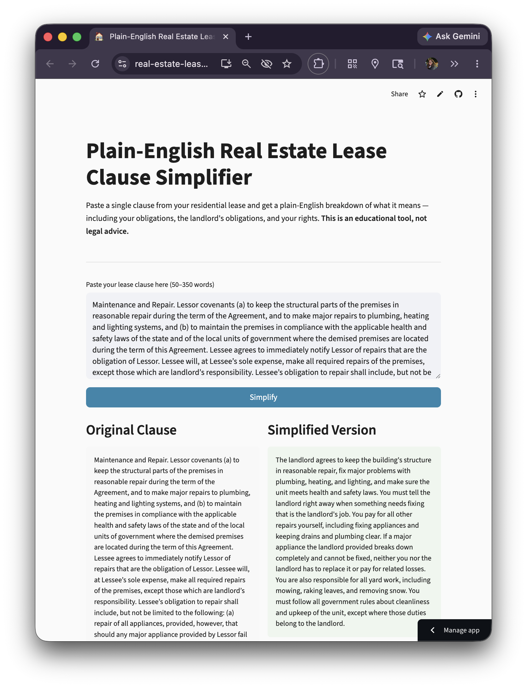
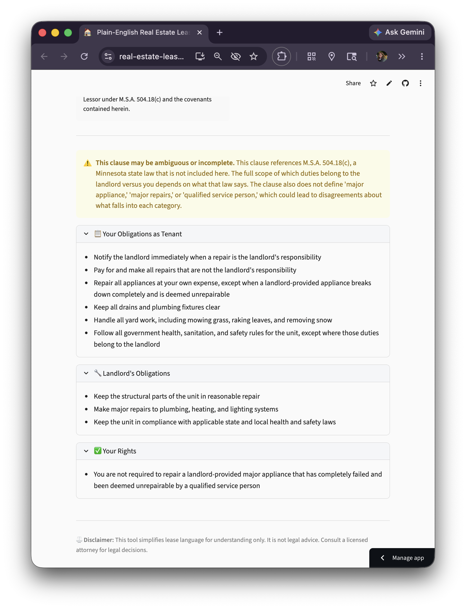
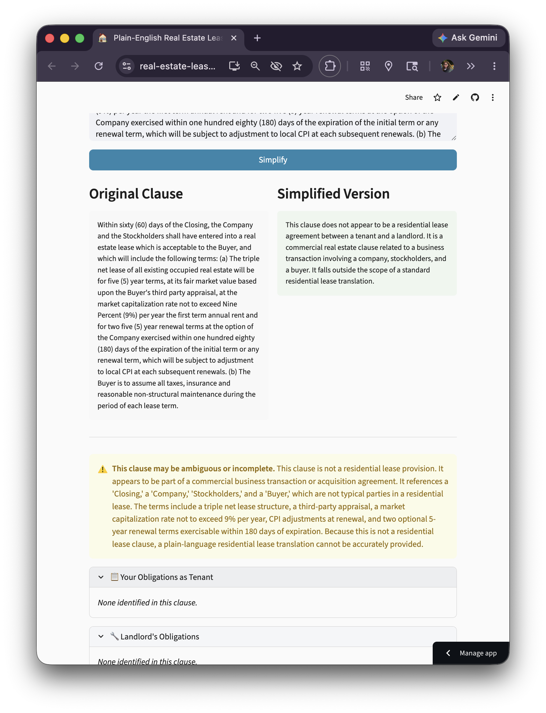

# Plain-English Rewriter for Residential Lease Clauses

A Streamlit app that takes dense legal language from U.S. residential lease agreements and rewrites it in plain English at an 8th-grade or below reading level, along with a structured breakdown of tenant obligations, landlord obligations, and tenant rights.

---

### Target User, Workflow, and Business Value

**Target user:** U.S. residential renters, particularly first-time renters, non-native English speakers, and anyone who lacks access to a lawyer — who need to understand what they are agreeing to before signing a lease.

**Workflow:** A renter receives a lease agreement. Instead of reading every clause as-is (most are written at a college reading level or higher), they paste individual clauses into this tool and get a plain-English breakdown in seconds. The breakdown tells them exactly what they must do, what the landlord must do, and what rights they have, without the renters needing legal training.

**Business value:** Reduces information asymmetry between tenants and landlords. A renter who understands what they're signing is less likely to be surprised by penalties, or violate their lease unknowingly, and they will be better positioned to negotiate lease terms. The tool replaces a task that would otherwise require either a lawyer consultation (~$200–$500/hour) or time-consuming self-research with uncertain quality.

---

### Problem Statement and Solution

**Problem:** Residential lease clauses are written in dense legal language that most tenants cannot easily understand. The average U.S. lease is written at a college-grade reading level. Tenants routinely sign agreements they don't fully understand, leading to disputes, unexpected fees, and forfeited rights.

**Why GenAI fits:** This is a document-understanding and language-transformation task.  Large language models do these tasks well. The transformation is deterministic in structure where it produces the same output schema every time but requires language understanding to paraphrase accurately without changing the legal meaning. Rule-based approaches like find-and-replace, or readability filters cannot do this as well as a trained LLM can. The task is also well-scoped in a way that it can process one clause at a time with no external tool calls required, to give an output in structured JSON.

**Why not a simpler approach:** A Flesch-Kincaid optimizer or word-synonym-swapper would reduce reading level mechanically but would not identify which party bears each obligation, would not flag ambiguity, and would not preserve legal accuracy. A Gen AI model can do all three simultaneously.

---

### System Design and Baseline

**Architecture:**

**Model:** Claude Sonnet. Sonnet was chosen over Haiku for accuracy on nuanced legal language, and over Opus for cost-efficiency given that this is a single-call, single-clause workflow with no tool use or multi-step reasoning required.

**Prompt design:**
- The prompts instruct the model to rewrite at 8th-grade level, return strict JSON, never give legal advice, and flag ambiguity
- 5 few-shot examples (security deposit, maintenance, pets, subletting, cross-reference) were given to demonstrate the expected transformation and JSON schema which is needed to produce structured outputs. 
- Temperature was set to low as it is adequate for consistent structured output, non-zero to allow natural paraphrase variation

**Baseline:** "Original clause as-is" — the renter reads the raw legal text with no assistance. The baseline Flesch-Kincaid grade for the 30-clause test set averages ~13.4 (roughly 1st-year college level). The app targets grade ≤ 8.

---

### Evaluation Plan

**Test set:** 30 clauses across 10 categories (security deposit, maintenance, termination, liability, pets, late fees, noise/conduct, subletting, insurance, utilities), each 50–300 words. 
Includes edge cases: cross-reference clauses, an ambiguous clause, a contradictory clause, and a dual-fee clause.

**Automated metrics:**
- **Flesch-Kincaid grade level** on simplified output (target ≤ 8 grade readinig level)
- **Completeness** — fuzzy string match (partial ratio ≥ 65) of extracted obligations against keyo bligations per clause
- **Ambiguity flagging rate** — whether the model correctly raises the flag on tricky clauses

**Rubric (1–5 scale, scored by LLM-as-judge):**
| Dimension | Description |
|-----------|-------------|
| Simplicity | Is the output comprehensible to an 8th grader? |
| Completeness | Are all key obligations and rights captured? |
| Accuracy | Is the rewrite faithful — no distortions or omissions of legal meaning? |
| Clarity | Are ambiguities or contradictions flagged rather than silently resolved? |

**Judge model:** created with claude-Sonnet 4.6 at temperature 0, called separately from the simplification model to avoid self-evaluation bias. The judge is used only in the evaluation scripts since the app itself makes a single model call per clause.

**Baseline comparison:** evaluation/baseline.py computes original Flesch-Kincaid vs. simplified Flesch-Kincaid per clause and per category, generates a grouped bar chart, and writes a full markdown report.

---

## How It Works

1. Paste a lease clause (50–350 words) into the text box
2. Click Simplify
3. See a side-by-side comparison of the original and simplified version
4. Review the structured list of your obligations, landlord obligations, and your rights
5. If the clause is ambiguous or references other sections, a warning is displayed

---
### Artifact snapshot

**App Normal Test Case - simplifies a real estate lease clause**

**App Normal Test Case - landlord/tenant obligations, tenant rights**

**App Edge Test Case - Does not accept business lease clause and flags ambiguous language**

### Example Failure Cases and Limitations

**Failure Cases:**

| Failure case | Example | Current behavior |
|---|---|---|
| Cross-reference clauses | "Damages as defined in Article 7..." | Warns user; simplifies text as-is, may miss referenced terms |
| Ambiguous clauses | "Landlord may enter at reasonable times" — no notice period specified | Ambiguity flag raised and model notes the gap |
| Very short input | Single phrase, no full clause | Rejected by input guardrail |
| Advisory language in output | Model occasionally adds "you should consult a lawyer" | Redacted by output guardrail |
| State-specific law | Clause about security deposit return timing | Model does not know the state; cannot flag deviations from local law |
| Contradictory terms | "No pets allowed" + "Pet deposit: $500" | Model identifies the contradiction and flags ambiguity |

---

**Limitations**

- **Cross-references:** The app simplifies only the pasted text. If a clause says "See Section 4.2," the app cannot look up that section.
- **State-specific law:** The app does not know which state the lease is from and cannot flag state-specific legal issues (e.g., California's 21-day deposit return rule).
- **Not legal advice:** The app may miss nuances. It is a comprehension aid, not a substitute for an attorney.
- **Clause length:** Very long clauses ( more than 350 words) should be split for best results.
- **Implicit terms:** Obligations implied by local law or context (rather than stated in the clause) may not be captured.

## How to get API Key and run on terminal

Get an Anthropic API key
- This app uses Claude, so you need an API key from Anthropic.

Go to https://console.anthropic.com/ and log in
- Go to Settings -> API Keys
- Create Key, give it a name, and copy the key (it starts with sk-ant-)
- Add a small amount of credit on the Billing page if your account doesn't have any. A single clause costs less than a cent to process.

Add your API key to a .env file
- Copy the template and paste in your key:
- cp .env.example .env
- Open .env and replace the placeholder: ANTHROPIC_API_KEY=sk-ant-your-key-here
-  Run the app in your terminal: streamlit run app.py